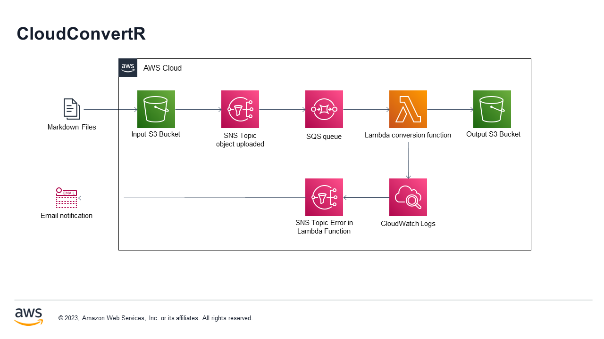

# CloudConvertR

O CloudConvertR é um projeto desenvolvido com o objetivo de explorar e aprender conceitos iniciais de computação em nuvem. Ele é um conversor de arquivos baseado na nuvem, permitindo a conversão fácil e rápida de arquivos markdown para HTML.

  

Clique [aqui](https://adneycm.github.io/CloudConvertR-docs/) para visitar o site da documentação.

Nosso projeto foi implementado na AWS e para isso fora utilizado o Terraform. Utilizamos os seguintes serviços da AWS: S3 para armazenamento, SNS para notificações, SQS para filas de mensagens, Lambda para execução de código e CloudWatch para monitoramento. Toda a aqruitetura do projeto pode ser vista na imagem abaixo:

    
  </a>

